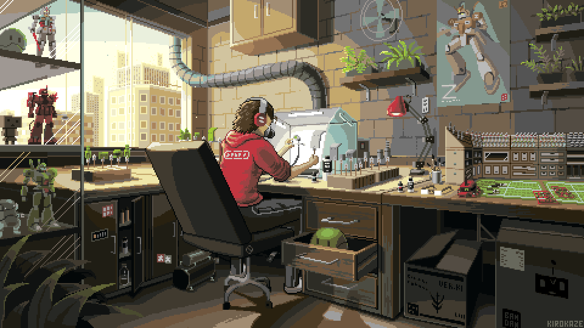

  

<h1 align="center">Hi 👋, I'm Fachrezi Bachri</h1>
<h3 align="center"><Hello, World!/></h3>

<h3 align="center">

</h3>

  

## 🔭 Saat ini saya sedang mengerjakan
- Website portfolio pribadi menggunakan React & Tailwind 
- Aplikasi toko online dengan Flutter 
- Mengembangkan kemampuan Struktur Data & Algoritma

## 🌱 Sedang mendalami Laravel 
- CRUD dan RESTful API dengan Laravel 
- Laravel + Vue.js/React untuk Frontend 
- Database Migration & Seeding 
- Laravel Testing 
- Laravel Queues & Jobs

## 💬 Open discussion about 
- HTML, CSS, JavaScript 
- PHP & Laravel 
- MySQL 
- Git & GitHub 
- C++

## ⚡ Fun fact 
- Stack Overflow adalah sahabat sejati 
- Punya koleksi stiker laptop lebih banyak dari koleksi baju 
- Lebih sering ngobrol sama ChatGPT daripada manusia

## 🛠️ Bahasa dan Alat
| 👨‍💻 Programming Languages | 🚀 Frameworks | 🗄️ Databases | 🛠️ Software and Tools |
|:---:|:---:|:---:|:---:|
|       |      |    |       |

 
<h2>📊 Statistik dan Aktivitas Github</h2>

  
   

   <!-- Optional: Tambahkan section activity graph yang terpisah -->
   

       
📈 Grafik Aktivitas

       
   

   

       
🏆 Piala GitHub

        
       

           
       

   

   

       
🔍 Details
    
        
       

           
       

         
       

           
       

   

   

       
<b>⚡ Aktivitas GitHub Terbaru</b>

        
       

           
       

   

<h1 align="center">🌐 Sosial Media</h1>

&nbsp;&nbsp;
&nbsp;&nbsp;
&nbsp;&nbsp;
&nbsp;&nbsp;
&nbsp;&nbsp;

